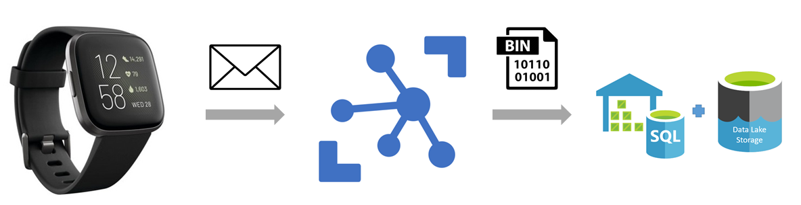
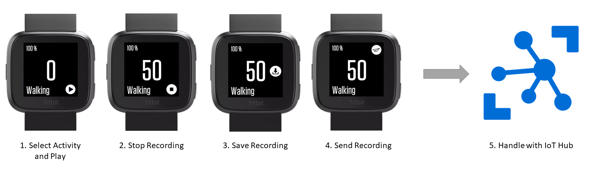

# Fitbit Activity Recording Application.

Human activity recognition is the problem of classifying sequences of sensor data (typically: accelerometer, gyroscope, heart rate) recorded by specialized harnesses or smart devices into known well-defined movements.

The information retrieved from inertial sensors embedded in everyday devices, such as smartphones or smart watches, can be used to classify a set of physical activities through a supervised Machine Learning algorithm.

It is a challenging problem given the large number of observations produced each second, the temporal nature of the observations, and the lack of a clear way to relate sensor data to known movements.

Classical approaches to the problem involve hand crafting features from the time series data based on fixed-size windows and training machine learning models, such as ensembles of decision trees.

Recently, deep learning methods such as recurrent neural networks and convolutional neural networks (CNNs) have been shown to provide state-of-the-art results on challenging activity recognition tasks with little or no data feature engineering.


## About this Fitbit App

This Fitbit App records accelerometer and gyroscope raw data at 10Hz from the smart device and gives the option to the user wearing the watch to 'label' the raw data. Once the data has been recorded and labled, the user can choose to save and store the data using a web service. 

The goal of this app is to start collecting enough data to put together a dataset to build and train a classification algorithm able recognize human activities.

[Azure IoT Hub](https://azure.microsoft.com/en-us/services/iot-hub/) solution was used to enable highly secure and reliable communication between an IoT application and the smart device. The incoming messages were managed and routed to a Storage account via the IoT Hub connection (see the diagram bellow).




## How to use this Fitbit App

This application has been developed only for Fitbit Versa and requires a web service for sending and storing a dataset.

The application is designed to send raw sensor data through a post request within the **uploadDataToServer** function under **./common/utilsCompanion.js**. You might need to update the fetch URI and Bearer token.

The web service should handle requests containing the raw sensor data in a json format. As of now, the application is configured to send 'packages' of 7 sensor measurements (ActivityId, AccX, AccY, AccZ, GyroX, GyroY, GyroZ) with a 'window frame' of 10 samples each package (7x10 matrix). 

The expected POST request body format is:
```json
{"data" : 
"
  [
      [ ActivityId, AccX , AccY , AccZ , GyroX, GyroY, GyroZ ],
      [ ActivityId, AccX , AccY , AccZ , GyroX, GyroY, GyroZ ],
      [ ActivityId, AccX , AccY , AccZ , GyroX, GyroY, GyroZ ],
      [ ActivityId, AccX , AccY , AccZ , GyroX, GyroY, GyroZ ],
      [ ActivityId, AccX , AccY , AccZ , GyroX, GyroY, GyroZ ],
      [ ActivityId, AccX , AccY , AccZ , GyroX, GyroY, GyroZ ],
      [ ActivityId, AccX , AccY , AccZ , GyroX, GyroY, GyroZ ],
      [ ActivityId, AccX , AccY , AccZ , GyroX, GyroY, GyroZ ],
      [ ActivityId, AccX , AccY , AccZ , GyroX, GyroY, GyroZ ],
      [ ActivityId, AccX , AccY , AccZ , GyroX, GyroY, GyroZ ]
  ],
  [
      [ ActivityId, AccX , AccY , AccZ , GyroX, GyroY, GyroZ ],
      [ ActivityId, AccX , AccY , AccZ , GyroX, GyroY, GyroZ ],
      [ ActivityId, AccX , AccY , AccZ , GyroX, GyroY, GyroZ ],
      [ ActivityId, AccX , AccY , AccZ , GyroX, GyroY, GyroZ ],
      [ ActivityId, AccX , AccY , AccZ , GyroX, GyroY, GyroZ ],
      [ ActivityId, AccX , AccY , AccZ , GyroX, GyroY, GyroZ ],
      [ ActivityId, AccX , AccY , AccZ , GyroX, GyroY, GyroZ ],
      [ ActivityId, AccX , AccY , AccZ , GyroX, GyroY, GyroZ ],
      [ ActivityId, AccX , AccY , AccZ , GyroX, GyroY, GyroZ ],
      [ ActivityId, AccX , AccY , AccZ , GyroX, GyroY, GyroZ ]
  ]
"
}
```

Once the web service has been configured and the application is installed on the Fitbit, you need to manually start/stop/save the sensor recording and send the request through the buttons on the screen, see the diagram bellow.


